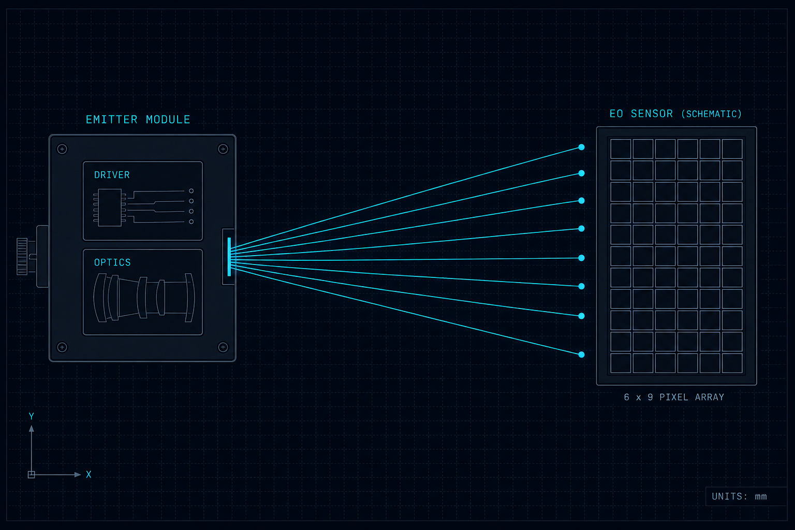
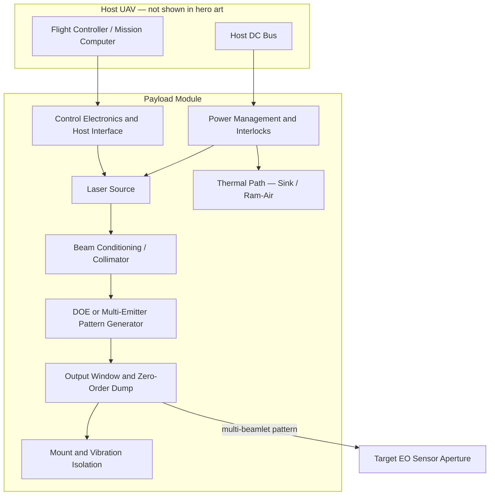

# Counter-UAS Multi-Point Laser Dazzler Prototype

**Internal codename:** MPL-D  
**Organization:** Fratres X AI — Defense Projects  
**Repository:** https://github.com/Fratres-X-AI/MPL-D  
**Document maturity:** Preliminary Design (documentation package complete; **no hardware energized, no bench tests executed**)



*Schematic only: compact emitter/optics assembly, multi-point NIR beam delivery, simplified EO focal plane. **No host platform or airframe depicted.** Not an engineering drawing.*

**Framing:** This repository is a **conceptual / non-kinetic sensor-denial study** only. It describes defensive soft-kill against hostile UAS electro-optical sensors—not hard-kill burn-through, not anti-personnel employment, not a fielded weapon.

---

## What this project is

Design documentation for a **drone-mountable multi-point laser dazzler** intended to degrade, saturate, or temporarily blind enemy UAS cameras (visible and silicon NIR paths where applicable). Architecture prioritizes a **patterned low-power beam** (diffractive splitter or fixed multi-emitter layout) over a single high-power focused beam.

| Item | Status |
|------|--------|
| Overall program maturity | **Preliminary Design** (paper + analysis; Phase 0 bench **not started**) |
| Documentation gate (G-DOC) | **PASS** — safety drafts, procedures, traceability exist |
| Prototype documentation gate (G-PROTO) | **PASS** — architecture, BOM, tests defined |
| Energization gate (G-ENR) | **BLOCKED** — LSO unsigned; P0 hardware not on hand |
| Flight test | **Not authorized** in Phase 0 scope |

Full gate table: [`docs/phase0_gate_status.md`](docs/phase0_gate_status.md)

---

## Deliverable 1 — System architecture

**Maturity:** Preliminary Design. **Evidence:** block diagram and subsystem boundaries in [`docs/ARCHITECTURE.md`](docs/ARCHITECTURE.md). No integrated CAD release, no measured subsystem data.

### Block diagram



### Major components

| Component | Role | Maturity |
|-----------|------|----------|
| Laser source | 940 nm fiber-coupled class leading candidate (~10 W CW rated, pulsed duty on host); 532 nm alternate for visible-surrogate path | Preliminary Design — **not procured** |
| Beam conditioning | Collimation; spatial filter optional | Preliminary Design |
| Pattern generator | Static DOE (3×3 grid planning) or 3–9 discrete emitters | Preliminary Design — **no fabricated DOE tested** |
| Output optics | Window, zero-order block (REQ-S-003) | Preliminary Design |
| Power / thermal | Driver ≥13 A class; passive sink + optional fan; ≤10% avg duty / 60 s planning | Preliminary Design — **no soak data** |
| Mount / interface | Centerline under-fuselage on **Drone-X** host; **10 kg payload** program baseline | Concept — hardpoint drawing **not in repo** (R-INT-001) |
| Targeting integration | Arm/pulse commands from host; **no closed-loop track in Phase 0** | Preliminary Design (paper) |

### Host integration (planning)

| Host class | Integration concept | Air-to-air notes | Maturity |
|------------|---------------------|------------------|----------|
| **Drone-X** VTOL / fixed-wing | Centerline mount; host boresight + static pattern FOV | Defensive intercept geometry: host maintains LOS to target EO aperture; static pattern widens capture vs single beam | Concept |
| Small tactical multirotor | 0.3–1.5 kg module; ≤5 W optical; low duty | Terminal-phase pulses only; severe thermal/power limits | Concept |
| Air-launched pod | Separate battery/seeker stack | Out of Phase 0 scope | Concept only |

**Eye-safety / ROE (architecture):** Diverging multi-beamlet emission creates off-axis hazard paths. NHZ analysis and Protocol IV defensive-employment framing are **required before energization**—see Deliverable 4 and [`docs/ARCHITECTURE.md`](docs/ARCHITECTURE.md) §6.

**Deep dive:** [`docs/ARCHITECTURE.md`](docs/ARCHITECTURE.md) · [`hardware/preliminary_optical_layout.md`](hardware/preliminary_optical_layout.md) · [`hardware/electrical_architecture.md`](hardware/electrical_architecture.md)

---

## Deliverable 2 — Directed energy and beam physics

**Maturity:** Preliminary Design (trade study + first-order models). **Evidence:** [`docs/PHYSICS_BASIS.md`](docs/PHYSICS_BASIS.md), [`analysis/nir_940nm_link_budget_notes.md`](analysis/nir_940nm_link_budget_notes.md). **No dazzle threshold validated on any sensor.**

### Recommended laser sources (planning)

| Path | Wavelength | Power class | Rationale | Limitation |
|------|------------|-------------|-----------|------------|
| **Leading candidate** | **940 nm** ±5 nm | ~10 W CW rated (pulsed on host) | AeroDiode-class fiber module; aligns with silicon NIR sensor paths | Fails on IR-cut filtered EO; invisible collateral hazard |
| Alternate (bench) | **532 nm** DPSS/diode | 2–10 W pattern total | Visible surrogate testing; easier beam diagnostics | Poor match to many IR imagers; visible signature |
| Rejected Phase 0 | Single 10–100+ W focused beam | — | Exceeds SWaP, thermal, safety envelope on small UAV | Contradicts multi-point requirement |

Commercial examples bounded in [`hardware/candidate_components.md`](hardware/candidate_components.md). **No SKU procured or bench-verified.**

**Single vs dual wavelength:** Phase 0 plans **single band** until three-class surrogate testing shows the chosen band fails. Dual-band adds drivers, thermal paths, eyewear, and separate NHZ cases—**not default**.

### Pattern generation (multi-point)

**Primary:** One quality source → collimator → **static DOE** (3×3 or 5-spot planning; η_DOE ~0.60–0.85 vendor-class, **unmeasured**).

**Alternate:** Fixed array of 3–9 discrete emitters (alignment drift risk under vibration).

**Deprioritized Phase 0:** Galvo, MEMS, acousto-optic scanning—moving parts without validated engagement gain.

### Why multi-point (not single high-power beam)

| Mechanism | Intent | Evidence status |
|-----------|--------|-----------------|
| Spatial coverage | Host UAS often carry multiple EO apertures (nose, belly, gimbal) | Geometry — **not flight-tested** |
| Motion uncertainty | Static spread compensates for lack of Phase 0 tracking | Planning — R-TRK-001 open |
| Sensor overload | Multiple spots may saturate CMOS rolling shutter / AGC | Surrogate bench **pending** |
| Power tier | Splits fixed P_opt across N beamlets—lower per-spot irradiance, acceptable for denial vs burn-through | First-order model only |

**Not claimed:** GPS denial, permanent sensor damage, effectiveness against MWIR/LWIR thermal imagers, or AI-glare rejection defeat.

**Deep dive:** [`docs/PHYSICS_BASIS.md`](docs/PHYSICS_BASIS.md) · [`analysis/beam_propagation_notes.md`](analysis/beam_propagation_notes.md)

---

## Deliverable 3 — Power, thermal, and effects envelope

**Maturity:** Preliminary Design — analytical bounds only. **Evidence:** [`analysis/power_thermal_budget.py`](analysis/power_thermal_budget.py), [`analysis/thermal_pulse_model.py`](analysis/thermal_pulse_model.py). **Uncertainty: ±order of magnitude on range and duty until bench data.**

### Power and thermal budget (planning estimates)

| Parameter | Conservative bound | Notes |
|-----------|-------------------|-------|
| P_opt (total pattern) | **2–10 W** | Above ~10 W continuous on small hosts likely incompatible without aggressive pulsing |
| η_wp (940 nm planning) | **0.35–0.50** (use 0.40 nominal) | Vendor typ higher; do not assume upper bound without datasheet at operating point |
| P_elec @ 10 W opt, η=0.40 | **~25 W** electrical | **~10 W** dissipated heat (typ) |
| P_elec @ 5 W opt, η=0.22 | **~23 W** | Legacy 532 nm planning example |
| Duty cycle (small host) | **≤10% average over 60 s** | [`hardware/pulse_control_spec.md`](hardware/pulse_control_spec.md) |
| Module mass (planning rollup) | **~0.7–3 kg** | [`hardware/mechanical_bom.md`](hardware/mechanical_bom.md) |
| Cooling | Passive sink + optional 5–12 V fan | Liquid cooling rejected for SWaP; hover VTOL may lack ram-air (R-THM-001) |

**Feasibility statement:** Bench demonstration on lab power is plausible. Continuous full-power dazzle on a small tactical drone is **questionable** without measured thermal curves and host bus capacity.

### Engagement envelope vs sensor classes (not certified ranges)

| Target sensor class | Planning assessment | Maturity |
|--------------------|---------------------|----------|
| Commercial FPV CMOS (unfiltered) | Bench dazzle **may** be observable at tens of meters at full beamlet power | Preliminary Design — T-03 **not run** |
| IR-cut filtered CMOS | 940 nm **may show no effect**; 532 nm candidate for this class | Surrogate Class 2 — **test required** |
| NIR-augmented / Starvis-class | 940 nm **may** couple; threshold unknown | Surrogate Class 3 — **test required** |
| Military fused EO / MWIR | **Not addressed** by NIR dazzle alone | Out of Phase 0 extrapolation (R-EFF-001) |

**First-order irradiance (940 nm, single beam, θ=1 mrad, clear air, unvalidated):**

| Range | I_eff (order of magnitude) |
|-------|----------------------------|
| 500 m | ~0.8 W/m² |
| 1000 m | ~0.2 W/m² |

With 9-spot DOE (η=0.75), per-beamlet irradiance is **~9× lower**—coverage vs peak trade. These numbers **do not** certify dazzle success at any range.

**Atmospheric effects:** Beer-Lambert extinction (σ = 0.05–0.2 km⁻¹ clear-air planning); haze/fog not modeled for tactical use; turbulence/scintillation omitted from point estimates—outdoor engagement **less predictable** than bench (R-ATM-001).

**Deep dive:** [`analysis/nir_940nm_link_budget_notes.md`](analysis/nir_940nm_link_budget_notes.md) · [`docs/CONOPS.md`](docs/CONOPS.md)

---

## Deliverable 4 — Major risks and limitations

**Full register:** [`docs/RISK_REGISTER.md`](docs/RISK_REGISTER.md) (15 tracked risks)

### Technical

| Risk | Plain statement |
|------|-----------------|
| R-EFF-001 | Open literature does not validate low-power multi-point dazzle against filtered, AGC-controlled, or AI-assisted threat sensors at operational ranges. |
| R-VIB-001 | VTOL/prop vibration may decenter pattern on cm-class apertures at range—**no vibration-table data in repo yet**. |
| R-THM-001 | Heat from η_wp limits duty cycle; may consume **10–30%** additional mission energy during dazzle (planning, unvalidated). |
| R-ATM-001 | Haze, fog, scintillation may reduce useful envelope below planning tables. |
| R-TRK-001 | Static pattern without tracking may miss maneuvering targets. |
| R-DOE-001 | Zero-order leakage wastes power and creates hazard path—must be measured before full power. |

### Operational / policy

| Risk | Plain statement |
|------|-----------------|
| R-EYE-001 | IEC 60825-1 NHZ **not completed**—no numeric hazard zones in repo. NIR beams are invisible; collateral exposure risk is real. |
| R-ROE-001 | Protocol IV blinding-weapons classification depends on employment parameters—**unresolved** at this maturity. |
| R-EXP-001 | ITAR/EAR may apply—see [`docs/EXPORT_CONTROL_SCREENING.md`](docs/EXPORT_CONTROL_SCREENING.md). |
| R-REG-001 | Outdoor/flight laser tests require separate authorization—Phase 0 scoped to indoor bench only. |

### Documentation

| Risk | Plain statement |
|------|-----------------|
| R-DAT-001 | AI-assisted documentation may contain omissions or numeric errors—independent review and bench validation required before design commitment. |

**Cross-cutting gap:** Procuring fewer than three surrogate sensor classes (unfiltered CMOS, IR-cut CMOS, NIR-augmented) **does not** close the wavelength down-select.

---

## Deliverable 5 — Concept of operations

**Maturity:** Preliminary Design. **Not authorized for field employment.**

Defensive drone-on-drone sensor denial: host points boreSight toward target EO aperture; static multi-point pattern increases capture volume vs single beam. Pulse bursts (0.1–3 s planning) on lock cue—**Phase 0 has no closed-loop tracking.**

Flashlight metaphor (planning): operator geometry is “shine dazzler at enemy camera”; internal DOE may split cone into beamlets.

**Deep dive:** [`docs/CONOPS.md`](docs/CONOPS.md)

---

## Deliverable 6 — Requirements and traceability

**Maturity:** Preliminary Design — 22 requirements defined; **no verification evidence recorded.**

| Category | Count | Example |
|----------|-------|---------|
| Functional / performance | REQ-F-001–006, REQ-P-001–002 | Multi-point output; non-kinetic intent |
| Environmental | REQ-E-001–003 | Vibration, thermal, atmospheric planning |
| Interface | REQ-I-001–003 | Host power, mount, Drone-X 10 kg baseline |
| Safety | REQ-S-001–004 | IEC 60825-1, interlocks, zero-order containment |
| Regulatory / ROE | REQ-R-001–004 | Protocol IV defensive framing |
| Operational | REQ-O-001–002 | Duty cycle, CONOPS alignment |

**Deep dive:** [`docs/REQUIREMENTS.md`](docs/REQUIREMENTS.md) · [`docs/REQUIREMENTS_TRACEABILITY.md`](docs/REQUIREMENTS_TRACEABILITY.md)

---

## Deliverable 7 — Phase 0 roadmap

**Maturity:** Phase 0 bench proof-of-concept — **not started** (energization blocked).

| Phase | Scope | Flight? | Maturity label |
|-------|-------|---------|----------------|
| **Phase 0** | Bench pattern (T-01), irradiance vs range (T-02), surrogate dazzle (T-03), power/thermal (T-04), vibration (T-05) | **No** | Target: Implemented & Tested (bench) — **not reached** |
| **Phase 1** | Ground mockup; limited flight **if separately authorized** | Optional, gated | Outline only |
| **Field employment** | Not in repository scope | — | Not planned |

**Phase 0 success (when executed):** Multi-point pattern documented at 2–10 m bench; irradiance within **±50% of model or model revised**; qualitative surrogate saturation only—**no operational range claim**.

**Deep dive:** [`docs/ROADMAP.md`](docs/ROADMAP.md) · [`tests/phase0_test_plan_outline.md`](tests/phase0_test_plan_outline.md) · [`tests/procedures/`](tests/procedures/)

---

## Deliverable 8 — Repository map and handoff

| Path | Contents |
|------|----------|
| [`docs/ARCHITECTURE.md`](docs/ARCHITECTURE.md) | Full architecture, laser trade, NHZ requirements |
| [`docs/PROTOTYPE_HANDOFF.md`](docs/PROTOTYPE_HANDOFF.md) | Package index and human-only gates |
| [`hardware/`](hardware/) | BOM, procurement, optics, pulse spec, interface |
| [`analysis/`](analysis/) | Link budget, thermal pulse, vibration models |
| [`firmware/pulse_controller_design.md`](firmware/pulse_controller_design.md) | Pulse state machine (design only) |
| [`tests/`](tests/) | SOP draft, T-01–T-05, templates |
| [`components/LaserDazzlerHero.tsx`](components/LaserDazzlerHero.tsx) | React hero (emitter-only visual; Tailwind + Framer Motion) |
| [`assets/preview-laser-dazzler-hero.html`](assets/preview-laser-dazzler-hero.html) | Static browser preview (no build step) |

### Immediate actions (human gates)

1. Assign named **LSO** — [`docs/lso_assignment_record.md`](docs/lso_assignment_record.md)
2. Complete **NHZ analysis** — [`docs/phase0_safety_case_draft.md`](docs/phase0_safety_case_draft.md)
3. Procure **P0 hardware** — [`hardware/procurement_status.md`](hardware/procurement_status.md)
4. Execute **T-01** at alignment power only after G-ENR prerequisites met

---

## Hero component (UI)

Emitter-only schematic—**no drone, UAV, or aircraft imagery.**

```tsx
import LaserDazzlerHero from "./components/LaserDazzlerHero";

export default function Page() {
  return (
    <LaserDazzlerHero
      architectureHref="/docs/ARCHITECTURE.md"
      technicalBriefHref="/docs/PROTOTYPE_HANDOFF.md"
    />
  );
}
```

Requires `framer-motion` and Tailwind. Open [`assets/preview-laser-dazzler-hero.html`](assets/preview-laser-dazzler-hero.html) for a zero-build preview.

---

## LinkedIn / external sharing note

Suitable for professional networking as a **conceptual counter-UAS sensor-denial documentation package**. Do not quote irradiance tables as operational range. Do not imply LSO approval, flight clearance, or threat effectiveness. See [`NOTICE`](NOTICE) for export and safety caveats.

---

## License

Documentation released under [MIT License](LICENSE). Hardware implementation and operational use remain subject to separate program, safety, and export-control approval.

---

*Fratres X AI | Defense Projects — Prototype Documentation · MPL-D internal codename*
