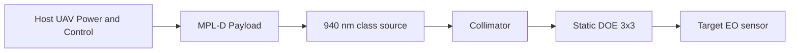

# Counter-UAS Multi-Point Laser Dazzler Prototype — Executive Summary

**Internal codename:** MPL-D · **Organization:** Fratres X AI — Defense Projects  
**Repository:** https://github.com/Fratres-X-AI/MPL-D  
**Package type:** Conceptual non-kinetic counter-UAS sensor-denial study — **not a proposal, not a capability claim, not a fielded system**

*Emitter/optics schematic only. No host platform depicted. Not an engineering drawing.*

---

## One-page summary

**Problem (planning):** Hostile small UAS rely on EO sensors; single high-power laser approaches exceed small-UAV SWaP and safety margins.

**Concept (Preliminary Design):** Drone-mountable module producing a **static multi-point NIR pattern** (940 nm fiber-coupled class leading candidate + static DOE) to degrade enemy UAS cameras — **non-kinetic, sensor denial only.**

**Maturity:** **Preliminary Design** on paper. Phase 0 bench **not started**. No hardware energized. No test records. No LSO. No export ruling.

**Host baseline (Concept):** Drone-X, 10 kg payload — ICD **not released** (R-INT-001).

---

## Program gates

| Gate | Status | Meaning for reviewers |
|------|--------|---------------------|
| **G-DOC** | **PASS** | Pre-energization documentation exists |
| **G-PROTO** | **PASS** | Design + test + traceability package defined |
| **G-SAF-01/02/03** | **OPEN** | LSO, NHZ, SOP **not approved** |
| **G-HW-P0** | **OPEN** | Hardware **not procured** |
| **G-ENR** | **BLOCKED** | **No laser energization authorized** |

Detail: [`docs/phase0_gate_status.md`](docs/phase0_gate_status.md)

---

## Deliverable maturity (eight-package structure)

| # | Deliverable | Maturity | Evidence status | Gap |
|---|-------------|----------|-----------------|-----|
| 1 | System architecture | Preliminary Design | ARCHITECTURE, ICD stub | No CAD; host ICD open |
| 2 | Beam physics / sources | Preliminary Design | PHYSICS_BASIS, link budget | θ, η_DOE unmeasured |
| 3 | Power / thermal / effects | Preliminary Design | Analysis scripts | **All models unvalidated** |
| 4 | Risks & limitations | Preliminary Design | RISK_REGISTER (15 risks) | 4 residual **High** |
| 5 | CONOPS | Preliminary Design | CONOPS.md | No field authorization |
| 6 | Requirements / RTM | Preliminary Design | 22 reqs traced | **0 verification passes** |
| 7 | Roadmap Ph 0/1/2 | Preliminary Design | ROADMAP.md | Ph 1/2 **not authorized** |
| 8 | Handoff / TDP | Preliminary Design | TDP_STRUCTURE, this repo | No TDP baseline tag |

---

## Top risks (residual after planned mitigations — most mitigations **not executed**)

| ID | Residual | Statement |
|----|----------|-----------|
| **R-EFF-001** | **High** | Dazzle vs threat EO **unproven** — no T-03 data |
| **R-EYE-001** | **High** | NHZ **incomplete**; 940 nm invisible beam |
| **R-VIB-001** | **High** | Pattern wander **unquantified** — no T-05 |
| **R-TRK-001** | **High** | Static pattern vs maneuver (Phase 0 accepted gap) |
| R-ROE-001 | Medium | Protocol IV — **no legal review** |
| R-EXP-001 | Medium | **No ITAR/EAR ruling** |

Full register: [`docs/RISK_REGISTER.md`](docs/RISK_REGISTER.md)

---

## Progress categories (current)

| Done | Still Weak | Risks | Next Steps |
|------|------------|-------|------------|
| TDP structure + **tdp-baseline-0.1** tag; RTM; gate/gap/execution trackers; NHZ template; CM plan Rev A; mitigation execution log; export workflow; atmospheric/tracking assessment | **Zero tests executed**; LSO/NHZ; hardware; export ruling; 0/22 RTM PASS | 4× residual **High** (R-EFF, R-EYE, R-VIB, R-TRK) | [`GATE_CLOSURE_PLAN.md`](docs/GATE_CLOSURE_PLAN.md) Block A → D |

**Handoff verdict:** Documentation baseline released — **not validated system handoff.** Detail: [`docs/HANDOFF_READINESS.md`](docs/HANDOFF_READINESS.md) · [`docs/HANDOFF_GAP_TRACKER.md`](docs/HANDOFF_GAP_TRACKER.md)

**TDP baseline:** `tdp-baseline-0.1` — [`docs/TDP_BASELINE_REGISTRY.md`](docs/TDP_BASELINE_REGISTRY.md)

---

## How to review (government / prime)

**Start:** [`docs/GOVERNMENT_REVIEW_GUIDE.md`](docs/GOVERNMENT_REVIEW_GUIDE.md)  
**TDP map:** [`docs/TDP_STRUCTURE.md`](docs/TDP_STRUCTURE.md)  
**Handoff index:** [`docs/PROTOTYPE_HANDOFF.md`](docs/PROTOTYPE_HANDOFF.md)

**Do not infer:** operational range, threat effectiveness, safety approval, or export clearance from this repository alone.

---

## System architecture (summary)

Full diagram and trades: [`docs/ARCHITECTURE.md`](docs/ARCHITECTURE.md)

---

## Physics and effects (summary)

| Parameter | Planning estimate | Uncertainty |
|-----------|-------------------|-------------|
| P_opt | 2–10 W pattern | Vendor-class |
| η_wp | 0.35–0.50 @ 940 nm | Use 0.40 nominal |
| θ_half | 0.5–3 mrad | **Must measure** |
| I_eff @ 500 m (example) | ~0.8 W/m² single beam | **±order of magnitude** |
| Dazzle success | **Not modeled** | T-03 required |

Detail: [`docs/ANALYSIS_VALIDATION_STATUS.md`](docs/ANALYSIS_VALIDATION_STATUS.md) · [`docs/PHYSICS_BASIS.md`](docs/PHYSICS_BASIS.md)

---

## Compliance (summary)

| Topic | Status |
|-------|--------|
| Laser safety / NHZ | **Open** — [`docs/LASER_SAFETY_PLAN.md`](docs/LASER_SAFETY_PLAN.md) |
| Protocol IV / ROE | **Unresolved** — [`docs/ROE_PROTOCOL_IV.md`](docs/ROE_PROTOCOL_IV.md) |
| Export ITAR/EAR | **No ruling** — **HOLD** — [`docs/EXPORT_CONTROL_SCREENING.md`](docs/EXPORT_CONTROL_SCREENING.md) |

---

## Phase roadmap (summary)

| Phase | Status | Flight |
|-------|--------|--------|
| Phase 0 bench | **Blocked** (G-ENR) | No |
| Phase 1 integration | **Not authorized** | If approved separately |
| Phase 2 validation | **Not authorized** | TBD |

Detail: [`docs/ROADMAP.md`](docs/ROADMAP.md)

---

## Repository navigation

| Path | Contents |
|------|----------|
| [`docs/`](docs/) | Architecture, RTM, risks, safety, compliance, TDP |
| [`hardware/`](hardware/) | BOM, procurement, optics, interface |
| [`analysis/`](analysis/) | Link budget, thermal, vibration scripts |
| [`tests/`](tests/) | T-01–T-05 procedures, SOP draft |
| [`components/LaserDazzlerHero.tsx`](components/LaserDazzlerHero.tsx) | UI hero — emitter-only schematic |
| [`assets/preview-laser-dazzler-hero.html`](assets/preview-laser-dazzler-hero.html) | Browser preview |

---

## Hero component (non-operational visual)

Emitter-only — no drone imagery. Requires `framer-motion` + Tailwind if embedded in app.

---

## License and notices

Documentation: [MIT License](LICENSE). Export/safety: [`NOTICE`](NOTICE). Data rights stub: [`docs/DATA_RIGHTS.md`](docs/DATA_RIGHTS.md).

---

*Fratres X AI | Defense Projects — Prototype Documentation · MPL-D internal codename*
