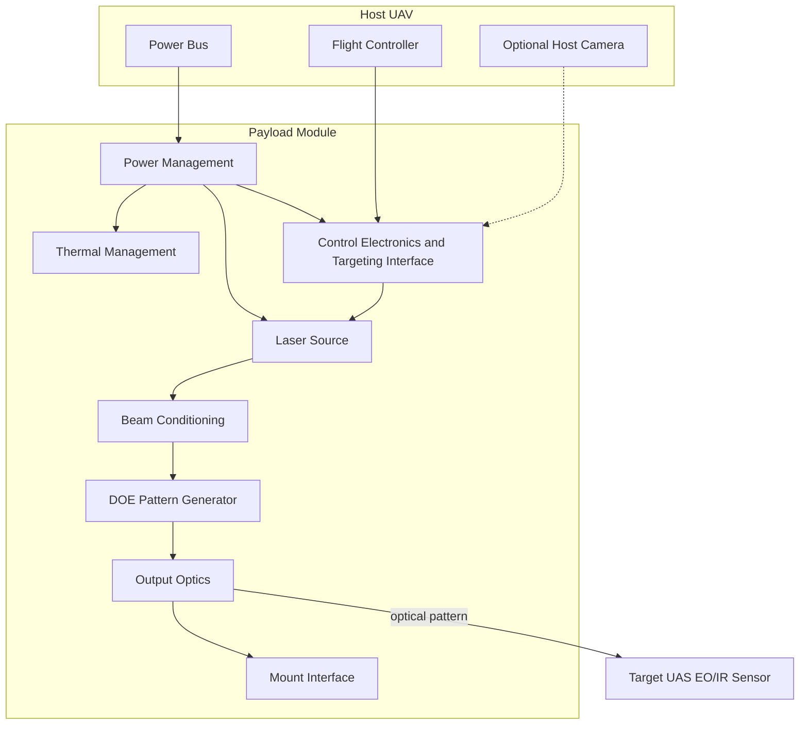

# System Architecture — Counter-UAS Multi-Point Laser Dazzler Prototype (MPL-D)

**Maturity:** Preliminary Design. Supporting evidence: Wavelength/power trade complete; 940 nm fiber-coupled path documented as leading bench candidate; optical stack, procurement list, pulse control, and surrogate test matrix defined. **No hardware procured, no NHZ completed, no bench measurements.**

**Project objective (verbatim):** Design a practical, drone-mountable (or air-launched) multi-point / pattern laser dazzler system focused on non-kinetic sensor denial against hostile drones. The primary goal is to degrade, blind, or overwhelm electro-optical sensors and cameras on enemy UAS rather than attempting hard-kill burn-through.

---

## 1. High-level architecture

### Block diagram

### Information and power flows

**Power flow:** Host DC bus → power management (conditioning, enable interlock) → laser drivers and control electronics. Majority of electrical energy converts to waste heat at laser modules (η_wp ≈ 0.15–0.35 planning range) → thermal management path to ambient or airframe.

**Control flow:** Flight controller or mission computer → arm/enable commands → control electronics → laser drivers (pulsed). Optional host camera metadata may cue dazzle timing in future phases; **Phase 0 has no closed-loop tracking.**

**Optical flow:** Laser source → beam conditioning (collimation, filtering) → DOE / pattern generator → output optics → mount interface → free-space propagation → target sensor aperture (uncontrolled alignment unless platform pointing cooperates).

---

## 2. Recommended laser source(s)

### Recommended approach

**Phase 0 leading path (planning):** **940 nm** AeroDiode-class 10 W fiber module → collimator → static DOE → centerline host mount concept. **532 nm** retained as comparison path if LSO authorizes dual-wavelength bench.

**Prior default (532 nm + DOE):** Still valid for surrogate Class 2 (IR-cut) emphasis — final single-band lock requires three-class surrogate results.

**Rationale:** Commercial availability, moderate wall-plug efficiency, established safety classification paths, and compatibility with COTS beam profiling for Phase 0. Visible wavelength simplifies surrogate camera testing (with acknowledged mismatch to IR-dominant military sensors).

**Rejected:** Single high-power focused beam (10–100+ W class) — exceeds small UAV thermal/power budget, increases eye hazard and export sensitivity, contradicts multi-point requirement. Kilowatt-class sources — **out of scope**.

---

### Laser Source Trade Study

**Maturity:** Preliminary Design — first-order wavelength and power class trade complete. No breadboard, thermal measurement, or sensor response data yet.

**Evidence basis:** Commercial laser *classes* (vendor datasheets exist in the public domain; no part numbers selected in this repository), first-order physics in `docs/PHYSICS_BASIS.md` and `analysis/power_thermal_budget.py`, and qualitative sensor/atmospheric literature classes. **No** measured dazzle threshold, **no** threat-representative EO/IR sensor testing, **no** integrated thermal or EMI characterization.

**Scope:** Non-kinetic sensor denial on hostile UAS EO/IR apertures. Not hard-kill burn-through. Not a certified engagement range or effectiveness claim.

#### Trade axes (what drives the down-select)

| Axis | Visible (520–532 nm DPSS / diode) | NIR (850–1064 nm diode / fiber-coupled) | Assessment (planning only) |
|------|-------------------------------------|----------------------------------------|----------------------------|
| EO sensor denial (visible-band CMOS) | Direct overlap with many commercial UAS camera bands | Weaker or indirect unless sensor has poor IR cut / leaky NIR path | Visible **may** align better with Phase 0 surrogate bench; **does not** prove military EO denial |
| IR sensor denial (MWIR/LWIR, IR-augmented EO) | Generally **poor** match to thermal imager bands | Better match to silicon NIR paths and some fused EO channels; **not** a substitute for dazzling thermal bands | NIR **might** help IR-augmented stacks; effectiveness against filtered/hardened IR **unknown** (R-EFF-001) |
| Simplicity / producibility | Mature 520–532 nm modules; DPSS adds thermal mass | Mature 850–980 nm fiber-coupled diodes; 1064 nm classes add optics/safety complexity | Trade is wavelength fit, not raw availability |
| SWaP | DPSS: moderate mass, heat sink often required | Fiber-coupled: compact emitter head; fiber routing adds integration risk | At 2–10 W optical class, **thermal dissipation dominates** SWaP more than wavelength choice |
| Eye safety / signature | High photopic hazard; **visible** off-axis signature | **Invisible** beam — higher accidental exposure risk | Neither is safe; NIR shifts hazard from perception to detection (R-EYE-001, Protocol IV review) |
| Atmospheric propagation | 532 nm: σ often 0.05–0.2 km⁻¹ clear-day planning band | 850–1064 nm: comparable order-of-magnitude in clear air | No wavelength winner proven without locale-specific data |

#### Visible wavelength (520–532 nm class)

**Commercial classes (no selected SKU):** Direct diode / DPSS modules near 520–532 nm; compact DPSS 532 nm modules (1–5 W optical class common in industrial/lab tiers).

**Pros (evidence class, not validated for this system):**

- Strong overlap with unfiltered commercial UAS visible imagers used as Phase 0 surrogates.
- Easier bench diagnostics (beam visualization with compliant methods; power meters widely calibrated at 532 nm).
- Established IEC 60825-1 classification workflows and protective eyewear supply chains at green wavelengths.

**Cons / limits:**

- **Mismatch risk** to IR-dominant or filtered military EO — dazzle success **not** inferable from green bench tests.
- Rayleigh scattering scales approximately as λ⁻⁴ — visible suffers **higher** clear-air scattering vs NIR at equal geometry (first-order; not campaign-validated).
- **Visible signature** increases detectability; complicates concealment and ROE narrative.
- **Eye hazard:** green is photopically weighted — nominal hazard zones are unforgiving for diverging multi-point patterns on dynamic platforms.
- DPSS paths: η_wp often better than bare diode at same color, but **heat load remains large** relative to small-UAV duty cycle.

#### NIR wavelength (850–1064 nm class)

**Commercial classes (no selected SKU):** Fiber-coupled diode modules (850–980 nm; 1064 nm where offered); VCSEL arrays near 850 nm (mW–W class; beam quality often poor for long-range dazzle without additional optics — **unproven** for this CONOPS).

**Pros (evidence class, not validated for this system):**

- Better alignment with silicon NIR sensor paths on many EO payloads relative to 532 nm.
- Lower Rayleigh scattering than visible at equal range — **may** improve transmission in clear air (order-of-magnitude only).
- Reduced visible signature to human observers (**not** reduced hazard).

**Cons / limits:**

- Many commercial cameras include IR-cut filters — NIR dazzle **may fail entirely** on filtered surrogates; military stacks more likely filtered (R-EFF-001).
- **Invisible beam collateral:** operators and bystanders lack visual warning; increased retinal exposure risk if NHZ discipline fails.
- MWIR/LWIR thermal imagers are **not** addressed by NIR dazzle; fused targeting pipelines **unknown**.
- VCSEL arrays: attractive on paper; pattern uniformity for multi-point dazzle **not** demonstrated in this program.

#### Multi-wavelength vs single-wavelength

| Approach | Claimed benefit | Cost / risk |
|----------|-----------------|-------------|
| Single visible | Lowest driver count, one safety case, one optics coating set | Leaves IR-path denial gap **unresolved** |
| Single NIR | Targets silicon NIR paths | Leaves visible-only and filtered EO gaps; invisible hazard |
| Dual-band (visible + NIR) | Covers more sensor classes in theory | Two drivers, thermal paths, wavelength-specific eyewear, boresight/coalignment, EMC, export/safety reviews; contradicts Phase 0 simplicity unless **measured** single-band failure on representative targets |

**Recommendation (planning):** **Single wavelength for Phase 0.** Dual-band is **not** justified without bench evidence that the chosen single band fails against the minimum viable surrogate sensor set. Second band is a Phase 1+ decision gate, not default architecture.

#### Optical and electrical power class (conservative bounds only)

| Parameter | Conservative planning bound | Notes |
|-----------|----------------------------|-------|
| Total optical power in pattern | **2–10 W** combined (low single-digit to low tens of watts) | Above ~10 W optical on small hosts **likely** incompatible with continuous operation without aggressive duty cycling |
| Per-module optical power | **0.5–5 W** class per emitter | Multi-point splits power across N beamlets — per-beam irradiance falls with N |
| Wall-plug efficiency η_wp | **0.10–0.40** (planning); do not assume upper bound without datasheet | Electrical draw scales as P_opt / η_wp |
| Electrical power at 5 W opt, η_wp = 0.22 | **~23 W** electrical, **~18 W** dissipated heat | Endurance limiter; not kW-class |
| Rejected power class | **≥10–100+ W** single-beam industrial/defense lasers | Exceeds SWaP, thermal, safety envelope for drone-mount Phase 0 |

**Endurance implication (unvalidated):** At η_wp ≈ 0.22 and 5 W optical, ~23 W electrical during dazzle may consume **10–30%** additional mission energy faster than baseline flight — treat as **uncertain** until measured on host bus.

#### Options summary (commercial classes only)

| Option | Wavelength | Planning P_opt | Maturity | Evidence |
|--------|------------|----------------|----------|----------|
| Fiber-coupled diode modules | 520 nm ±10 nm | 0.5–2 W / 2–10 W pattern | Preliminary Design (component class) | Vendor datasheets exist; none selected |
| Compact DPSS | 532 nm | 1–5 W / 2–10 W pattern | Preliminary Design (component class) | Thermal management required |
| Fiber-coupled diode | 850–980 nm (class) | 0.5–5 W / 2–10 W pattern | Preliminary Design (component class) | IR-cut filter risk on surrogates |
| Fiber / DPSS (1064 nm class) | ~1064 nm | 1–5 W (industrial tiers) | Preliminary Design (component class) | Fusion-stack benefit **unknown** |
| VCSEL arrays | ~850 nm (example) | mW–W | Concept for long-range dazzle | Beam quality **unproven** |
| **AeroDiode-class 940 nm fiber module** | 940 nm ±5 nm | **10 W CW rated** (single fiber; pulsed duty required on host) | Preliminary Design (**candidate SKU**) | Datasheet captured in `hardware/candidate_components.md`; **not procured or bench-tested** |

#### NIR candidate source package (940 nm / 915 nm class — user trade input)

**Maturity:** Preliminary Design — vendor datasheet parameters ingested for a compact fiber-coupled NIR path aligned with silicon sensor bands. **No procurement, no NHZ analysis, no dazzle validation at any range.**

A separate trade input proposes **915–940 nm, ~10 W fiber-coupled multimode diodes** (AeroDiode 940 nm 10 W Model 2 class: 105 µm core, NA 0.22, SMA905; ~11.5 A @ 1.7 V; vendor typ η ≈ 50%) for drone-on-drone centerline mount with pulsed operation and ram-air cooling. This **does not** supersede the Phase 0 visible-default path until the three-class surrogate sensor set is tested.

| Aspect | Assessment (conservative) |
|--------|---------------------------|
| Wavelength fit | 940 nm overlaps many silicon NIR-sensitive paths; **fails** on IR-cut filtered surrogates unless leakage path exists |
| Power class vs prior MPL-D bound | 10 W CW **equals** prior upper planning bound for **single** channel; with DOE split (N beamlets, η_DOE ~0.75) effective per-beamlet power drops to **~1 W class** — see `analysis/nir_940nm_link_budget_notes.md` |
| Range claims (~1000 m) | **Not certified.** Irradiance at 1000 m for θ = 1 mrad single-beam is **~0.2 W/m²** order (clear air); multi-point DOE reduces per-spot I further |
| Collimation | Vendor COL010 class cites ~12 mm beam; **multimode** fiber — measure θ_half (planning bracket 0.5–3 mrad until data) |
| Thermal | ~10 W dissipated at typ efficiency; ram-air scoop **concept only** — hover/low-speed VTOL may insufficient (R-THM-001) |
| Pulse CONOPS | 0.1–3 s bursts on target lock — planning only; LSO must classify pulsed NHZ before full-power bench |
| SWaP benchmark | LUMIBIRD ~0.5 kg dazzler module (vendor) is packaging reference only — **not** MPL-D validation |
| Hard-kill variants | LUMIBIRD “sensor destroyer” / burn-through modes — **out of scope** (defensive sensor denial only) |

**915 nm vs 940 nm:** Both available from multiple suppliers (~$475–600 class listings). Down-select requires surrogate tests on unfiltered vs IR-cut vs NIR-augmented classes — not datasheet comparison alone.

**Drone-X / payload:** Host **Drone-X** with **10 kg payload** capacity is the program integration baseline. Hardpoint geometry and power tap location are **not** in this repository — vendor confirmation still required (R-INT-001). Centerline mount without gimbal remains consistent with static-pattern architecture.

Full component tables, literature caveats, pulse/thermal notes: [`hardware/candidate_components.md`](../hardware/candidate_components.md). First-order 940 nm irradiance bounds: [`analysis/nir_940nm_link_budget_notes.md`](../analysis/nir_940nm_link_budget_notes.md).

#### Recommended next actions (laser source)

1. **Define minimum surrogate sensor set** for Phase 0 (unfiltered CMOS, IR-cut CMOS, IR-augmented path if available) — without this, wavelength down-select is speculative.
2. **Obtain and bench-verify** AeroDiode-class (or alternate) 940 nm module + collimator; measure θ_half before adopting 1000 m planning scenarios.
3. **Run parallel first-order budgets** for 532 nm DPSS+DOE vs 940 nm fiber+DOE using measured divergence and DOE efficiency — see `analysis/nir_940nm_link_budget_notes.md`.
4. **Commission LSO-led hazard analysis** (IEC 60825-1 NHZ) for selected single-band architecture before full-power pulsed bench; NIR invisible-beam collateral is **not** lower risk than visible.
5. **Document pass/fail criteria** against three surrogate classes; do not lock 915/940 nm single-band on vendor or paper claims alone.

---

## 3. Beam delivery and pattern generation

**Maturity (this subsection):** Preliminary Design — architecture down-select and pattern approach documented. Supporting evidence: COTS DOE/emitter classes bounded; **no** fabricated DOE, holographic element, alignment stack, irradiance map, vibration test, or flight integration data.

---

### Primary approach (Phase 0)

**Configuration:** One high beam-quality source (planning class: compact DPSS 532 nm or fiber-coupled visible diode with stable beam profile) → beam conditioning (collimation, optional spatial filter) → **static** diffractive or holographic splitter (DOE / HOE) → output aperture.

**Pattern:** Fixed multi-spot grid or line (planning: 3×3 or 5-spot linear; total field ~0.5–2°). Per-beamlet divergence: 1–5 mrad half-angle (compact optics class). Exact geometry and efficiency **unvalidated**.

**Rationale vs scanning:** Scanning (galvo, MEMS, acousto-optic) adds moving parts, control loops, higher electrical draw, and failure modes that scale poorly on small VTOL hosts. A static pattern trades flexibility for **predictable** SWaP, single-driver simplicity, and bench verifiability. For Phase 0 there is **no** closed-loop tracking; the pattern must cover target motion uncertainty by angular spread, not by beam steering. Irradiance per spot falls with spot count (∝ split of fixed P_opt); this is accepted — dazzle against commercial EO sensors is a threshold effect, not burn-through.

| Aspect | Static DOE / holographic splitter | Notes |
|--------|-----------------------------------|-------|
| Moving parts | None in pattern path | Mount isolation only |
| Drivers | One primary laser channel | Simpler interlock and EMI |
| Capture volume | Fixed FOV at boresight | Host must point; see integration |
| Known penalties | Diffraction efficiency loss; zero-order leakage; alignment sensitivity | Zero-order must be dumped (REQ-S-003) |

**Rejected for Phase 0 primary path:** Time-varying raster or Lissajous scan to simulate a grid — adds complexity without proven benefit at planned power tier.

---

### Alternative approach (secondary / IR-oriented)

**Configuration:** VCSEL array (planning example: 850 nm class) + microlens or micro-optic array → **incoherent** NIR flood or coarse multi-lobe pattern.

**Role:** Secondary architecture path when IR-heavy sensor denial is prioritized over visible surrogate testing. Lower spatial coherence may reduce speckle on some sensors; **does not** guarantee better dazzle — sensor AGC, bandpass filters, and sun background dominate outcomes (R-EFF-001).

**Tradeoffs vs primary:** Lower beam quality and poorer range scaling per watt; different eye-safety and export classification path; array uniformity and thermal cross-talk across emitters. **Maturity for this application:** Concept. Not recommended as Phase 0 sole architecture without IR test assets and separate hazard analysis.

---

### Deprioritized approaches (later phase only)

| Method | Why deprioritized (initial version) |
|--------|-------------------------------------|
| Galvo mirror scanning | Mass, power, bearing wear, vibration coupling, calibration drift |
| MEMS scanning mirrors | Control complexity, shock/vibration fragility, limited aperture |
| Acousto-optic deflectors | RF drive power, thermal, fixed efficiency vs wavelength, supply risk |

**Later-phase admission criteria (all required):** Quantified static-pattern miss rate on maneuvering targets (R-TRK-001); host power/thermal headroom; demonstrated vibration isolation insufficient for static pattern; legal/LSO approval for scanned emission CONOPS. Until then, scanning is **speculative** SWaP and reliability cost without validated engagement gain.

---

### Pattern purpose (operational intent, not performance claim)

The static multi-point pattern exists to:

1. **Cover multi-camera UAS layouts** — nose, belly, and gimbal sensors are not co-located; a single pencil beam requires precise boresight hold on one aperture.
2. **Absorb target and host motion uncertainty** — without Phase 0 tracking, angular spread substitutes for closed-loop aim (reduces peak I per spot).
3. **Potentially disrupt navigation / tracking loops** — saturation, bloom, or AGC pull-in on commercial-class EO may degrade closed-loop vision aiding; **effect on military-hardened EO/IR is unknown** and must not be assumed.

This is sensor denial at low combined power, not destruction. No claim of persistent blind or GPS denial.

---

### Limitations (stated plainly)

| Limitation | Mechanism | Planning impact |
|------------|-----------|-----------------|
| Platform vibration | Angular jitter → beam wander and spot decentering | Order-of-magnitude irradiance loss on sensor (R-VIB-001); worse on VTOL/prop hosts |
| DOE / laser thermal drift | Index change, mechanical expansion, wavelength shift | Pattern scale and zero-order walk; duty-cycle and cooling bound average power |
| Atmospheric turbulence / scintillation | Index fluctuations along path | Irradiance variance and fade; outdoor engagement less predictable than bench |
| Static pattern vs maneuver | Target leaves fixed FOV faster than host can reposition | Miss windows (R-TRK-001) |
| Multi-spot power split | Fixed P_opt divided across N beamlets | Per-spot I(R) drops; range shrinks vs single-beam same power |

**Omitted from Phase 0 claims:** Active beam stabilization, adaptive optics, and real-time pattern update.

---

### Host integration constraints

Effectiveness assumes the host **maintains line-of-sight** from payload aperture to target sensor volume for the engagement interval. Boresight is coarse-aligned to host approach axis (planning: ±1–3° per `hardware/interface_spec.md`); **no** perfect stabilization is assumed.

- Payload relies on **host pointing** + static pattern width, not an internal gimbal.
- Prop/rotor harmonics couple into mount; elastomer isolation is planning mitigation only — **not** validated in flight.
- If LOS breaks (terrain, aspect change, evasion), dazzle stops; there is no off-boresight compensation in Phase 0.

---

### Method summary (Phase 0 down-select)

| Method | Phase 0 status | Maturity (application) |
|--------|----------------|-------------------------|
| Static DOE / holographic splitter + single quality source | **Primary** | Preliminary Design (pending layout + bench) |
| Fixed array of 3–9 discrete emitters | **Acceptable alternate** | Concept (alignment drift risk) |
| VCSEL + microlens NIR flood | **Secondary / IR path** | Concept |
| Galvo / MEMS / acousto-optic scanning | **Deprioritized** | Not applicable Phase 0 |

### Preliminary Optical Stack Concept and Emitter/DOE Down-Select Criteria

**Maturity:** Preliminary Design — optical stack concept and down-select criteria documented. No hardware realization or measured pattern data.

This subsection states the **minimum** optical chain for Phase 0 planning and the **conservative** criteria for choosing between a static diffractive pattern generator and a multi-emitter array. It does **not** assert that any candidate will meet dazzle effectiveness, range, or flight survivability requirements.

#### Minimal optical stack (planning baseline)

The smallest credible beam-delivery path for bench and eventual payload integration is:

1. **Laser source** — one primary channel (planning class: compact DPSS or fiber-coupled **532 nm** module with stable beam profile; alternate paths are gated, not assumed).
2. **Beam conditioning / collimation** — expand or filter the source waist, set collimated beam diameter and divergence to the DOE or array input specification; optional spatial filter only if SWaP and alignment burden are accepted.
3. **Pattern generator** — **either** a static diffractive or holographic optical element (DOE / HOE) **or** a fixed multi-emitter layout (discrete diode modules or, on the IR path, VCSEL + microlens array).
4. **Output aperture / window** — defines clear diameter, contamination and coating set, and the last controlled optical surface before free-space propagation; must account for zero-order dump or block geometry if a DOE is used (REQ-S-003).
5. **Vibration isolation mount interface** — elastomer or soft-mount interface to the host hard point; **does not** replace the need to measure pattern wander under host vibration spectra (R-VIB-001). Isolation is mitigation only until T-05 or equivalent data exists.

**Explicitly out of scope for this minimal stack (Phase 0):** internal gimbal, galvo/MEMS/AO steering, adaptive optics, and real-time pattern update. Those add moving parts, control loops, and failure modes without validated engagement gain at the planned 2–10 W optical class.

#### DOE vs multi-emitter (including VCSEL array) — decision criteria

Down-select is **not** a paper trade. The following axes must be scored with bench evidence.

| Criterion | Static DOE / HOE + single quality source | Fixed multi-emitter (discrete modules) | VCSEL + microlens array (NIR secondary path) |
|-----------|------------------------------------------|------------------------------------------|-----------------------------------------------|
| **Complexity** | One driver, one alignment stack, one interlock path; adds custom or semi-custom DOE procurement and zero-order handling | N drivers, N alignment degrees of freedom, wiring and thermal paths scale with N | Array drive, per-emitter uniformity, microlens alignment; often **worse** beam quality per watt for long-range dazzle |
| **Thermal load** | Concentrated waste heat at single module + DOE absorption; duty-cycle and sink sizing dominate | Heat distributed but **summed** electrical draw still scales with N | VCSEL density → hot spots, wavelength drift, lobe power imbalance under soak **unvalidated** |
| **Vibration sensitivity** | Single rigid chain: jitter translates to whole-pattern wander and inter-beamlet registration error | Per-emitter boresight drift and relative registration error compound | Coarse lobes may mask small-scale jitter but **do not** prove stable dazzle on cm-class apertures at range |
| **Producibility** | Custom DOE lead time and single-source risk (R-SUP-001) | Higher part count, simpler optics per channel; alignment labor **likely** higher than one DOE stack | COTS arrays available; pattern uniformity and safety case for invisible NIR **not** demonstrated in this program |
| **Pattern stability under drone motion** | Fixed angular FOV at boresight; thermal and mechanical drift move entire grid and zero-order (R-DOE-001) | Fixed lobes if emitters stay aligned; **higher risk** of relative drift vs one DOE substrate | Flood or coarse multi-lobe; **does not** guarantee denial (R-EFF-001) |

**Conservative read:** DOE wins on driver count and bench repeatability **if** zero-order is measured and contained before full power. Multi-emitter wins **only if** DOE supply or zero-order risk blocks schedule **and** alignment drift is shown acceptable on vibration table. VCSEL array remains a **secondary / IR-oriented** path.

#### Current down-select recommendation (Phase 0)

| Path | Status | Phase 0 feasibility rationale |
|------|--------|----------------------------------|
| **Static DOE / HOE + single 532 nm-class source** | **Primary** | One electrical channel and one safety case; static pattern matches **no** closed-loop tracking; pattern verifiable on bench (irradiance map, zero-order dump) |
| **Fixed array of 3–9 discrete visible emitters** | **Acceptable alternate** | Admissible if DOE procurement or zero-order measurement fails gate (R-SUP-001, REQ-S-003) |
| **VCSEL + microlens NIR flood** | **Secondary only** | Weak Phase 0 sole architecture; filtered-surrogate failure modes (R-EFF-001) |

**Rejected as Phase 0 primary:** Galvo, MEMS, and acousto-optic scanning — moving parts without measured static-pattern miss-rate justification (R-TRK-001).

#### Explicit gaps (do not paper over)

- **No fabricated DOE or VCSEL array has been tested.** Pattern geometry, diffraction efficiency, and zero-order fraction are planning assumptions from vendor-class literature, not measured on this optical layout.
- **Pattern fidelity under representative vibration spectra and thermal drift remains unvalidated.** Bench-static alignment does not bound spot wander, inter-beamlet registration error, or zero-order leakage growth under VTOL/prop harmonics, gust, or maneuver (R-VIB-001).

#### Recommended next actions (beam delivery / pattern)

1. Down-select **DOE/holographic splitter vs fixed multi-emitter** using SWaP, zero-order safety, and supplier lead time (R-SUP-001).
2. Issue preliminary optical stack drawing: source waist, collimator F/#, DOE period/grid, dump optics for zero-order, aperture clear diameter.
3. Procure candidate DOE (or emitter array) and beam profiler path; execute T-01 pattern formation at 2 m with irradiance map.
4. Run low-duty alignment thermal soak; log spot centroid drift vs time.
5. Execute T-05 vibration table test; record angular wander vs input spectrum; compare to R-VIB-001 bounds.
6. Document whether static pattern geometry meets R-TRK-001 acceptability for planned CONOPS or flags Phase 1+ tracking as mandatory — **do not** assume scan hardware without this gate.

---

## 4. Power and thermal budget

See `analysis/power_thermal_budget.py` and `docs/PHYSICS_BASIS.md`.

Credible electrical draw, dissipated heat, and duty-cycle limits cannot be stated as validated subsystem numbers until the laser source class (discrete diode vs DPSS), driver topology, and pattern-generation loss budget are down-selected. The table below is first-order bounding only: it propagates planning-class η_wp and P_opt from Section 2 without a chosen part number, measured driver efficiency, or enclosure thermal resistance. Treat any single-point wattage (e.g., ~23 W electrical at 5 W optical) as an order-of-magnitude planning anchor, not a host-interface commitment.

| Parameter | Conservative bound | Basis |
|-----------|-------------------|-------|
| P_opt (total pattern) | 2–10 W | Drone feasibility |
| η_wp | 0.35–0.50 (940 nm candidate typ); 0.15–0.35 (532 nm planning) | Vendor typ vs conservative bound |
| P_elec at 10 W opt, η=0.40 | ~25 W peak; ~10 W dissipated | AeroDiode-class datasheet typ |
| P_elec at 5 W opt, η=0.22 | ~23 W | Legacy planning example |
| Duty cycle (small host / pulsed) | ≤10% avg over 60 s (planning) | `hardware/pulse_control_spec.md` |

**Cooling:** Passive heat sink to free stream air; optional 5–12 V fan (+2–5 W draw). Liquid cooling **rejected** for SWaP.

**Feasibility:** Bench demonstration is feasible on lab power. Continuous full-power operation on small tactical drone is **questionable** without aggressive duty cycling — see R-THM-001.

**Maturity:** Preliminary Design — thermal and electrical bounds tied to 940 nm candidate and pulse duty planning. No measured thermal curves.

**Reference:** `hardware/pulse_control_spec.md`, `analysis/nir_940nm_link_budget_notes.md`.

---

## 5. Effective range and engagement envelope

**Blunt statement:** This repository does **not** certify an operational engagement range. First-order irradiance falls rapidly with range (∝ 1/R²) and atmospheric transmission.

An engagement envelope in meters cannot be credibly quantified until source class, output aperture diameter, and per-beamlet divergence are fixed; irradiance at the target scales with optical power, pattern fill factor, geometric spreading (∝ 1/R² per beamlet), and atmospheric transmission at the operating wavelength. Until those inputs are frozen, the conservative envelope rows below remain speculative first-order bounds derived from unvalidated surrogate-camera assumptions — not range certification, not effectiveness against filtered or AGC-controlled sensors.

| Target sensor class | Planning assessment | Evidence |
|--------------------|---------------------|----------|
| Commercial FPV CMOS (unfiltered) | Bench dazzle plausible at tens of meters at full beamlet power; **940 nm 9-spot DOE** reduces per-beamlet I — see link budget | First-order model only |
| IR-cut filtered CMOS | 940 nm may show **no effect**; 532 nm remains candidate for this class | Surrogate Class 2 — **test required** |
| NIR-augmented / Starvis-class | 940 nm **may** couple; threshold unknown | Surrogate Class 3 — **test required** |

**Conservative envelope (planning only, ±order of magnitude):**

- **940 nm single-beam (10 W, θ=1 mrad, clear air):** ~0.19 W/m² at 1000 m — **not** dazzle certification.
- **940 nm + 9-spot DOE (η=0.75):** per-beamlet I at 500 m ~ **0.07 W/m²** order — coverage vs peak trade.
- **Outdoor operational envelope:** **unvalidated** beyond surrogate bench (1–20 m Phase 0 target).

Atmospheric and scintillation may reduce bounds further.

**Maturity:** Preliminary Design — range bounds tied to 940 nm first-order model. No range test data.

---

## 6. Major risks and limitations

Full register: [`RISK_REGISTER.md`](RISK_REGISTER.md).

Summary:

- Vibration and beam wander on VTOL/prop platforms
- Thermal and power limits on host endurance
- Atmospheric degradation
- Eye safety and Protocol IV / export control
- **Sparse validation of low-power multi-point dazzle against operational threats**

> **Cross-Cutting Risks and Gaps**
>
> - **Sensor denial thresholds are underspecified in public literature** for FPV, commercial, and military UAS cameras under realistic exposure control (AGC), bandpass/NIR-cut filters, burst/HDR modes, and AI-assisted glare rejection. This program has no validated irradiance-versus-range curves for those stacks at the planned multi-point power tier.
> - **Pattern fidelity under operational vibration is unknown.** Bench-static DOE or multi-emitter alignment does not bound spot wander, inter-beamlet registration error, or zero-order leakage growth under host vibration spectra (VTOL/prop, gust, maneuver). No vibration-table data exists in-repo.
> - **Eye safety and Protocol IV outcomes are parameter-locked, not resolved at Preliminary Design maturity.** Hazard classification and employment legality shift with wavelength, pulse structure, divergence, range to non-combatants, and atmospheric scattering; a visible multi-point dazzler is not automatically equivalent to an IR-only sensor-denial path for safety or export review.

### Phase 0 Minimum Surrogate Sensor Set

**Maturity:** Preliminary Design — surrogate set defined to enable Phase 0 test planning. No actual sensor samples procured or characterized yet.

**Evidence basis:** Sensor-class definitions derived from public commercial UAS and FPV camera literature classes. No measured spectral response, AGC transfer curves, or dazzle thresholds exist for this program.

This surrogate set is the minimum required before any final single-band or dual-band source recommendation can be locked. Absence of one class leaves the trade open.

| Class | Representative of | Spectral response (planning) | Typical AGC behavior (assumption) | Role in 532 nm vs NIR trade |
|-------|-------------------|------------------------------|-------------------------------------|----------------------------|
| **1. Unfiltered silicon CMOS** | Many FPV and low-cost commercial drone cameras with full visible + NIR sensitivity (no IR-cut filter) | Peak QE in visible; significant response into ~850–1000 nm unless filtered | Fast auto-exposure / auto-gain; may recover after dazzle pulse unless saturated or blinded | Bounds **532 nm** and **NIR (850–980 nm)** effectiveness on least-filtered commercial paths; visible and NIR both relevant |
| **2. IR-cut filtered CMOS** | Most daylight-optimized commercial UAS cameras and some military small-UAS EO stacks | Visible band emphasized; NIR heavily attenuated by dielectric IR-cut | AGC tuned for daylight scenes; may resist saturation differently than unfiltered paths | **Required** to test whether NIR-primary architecture fails against filtered EO; **532 nm** may remain only viable band for this class |
| **3. NIR-augmented or SWIR-capable sensor** | Low-light / IR-assisted drone cameras, some fused EO payloads with extended NIR or short-wave IR channels | Enhanced or dedicated NIR/SWIR path (class-dependent; not threat-representative without datasheet) | AGC and HDR modes vary; low-light modes may increase gain — dazzle interaction **unknown** | **Required** to bound **NIR (850–1064 nm class)** vs **532 nm** on sensors designed for low-light or IR-assisted imaging; absence leaves NIR trade speculative |

**Blunt constraint:** Procuring fewer than three classes, or substituting datasheet-only analysis without bench exposure, does **not** close the wavelength down-select. Military-hardened or AI-processed threat sensors remain outside this minimum set — Phase 0 results must not be extrapolated to them (R-EFF-001).

### Eye Safety and Nominal Hazard Zone Analysis Requirement

**Maturity:** Requirement defined at Preliminary Design level. **No NHZ analysis performed yet.** No nominal hazard zone dimensions, boundary distances, or exposure calculations appear in this repository.

**Evidence basis:** IEC 60825-1 framework referenced in `docs/REQUIREMENTS.md` (REQ-S-001) and `docs/RISK_REGISTER.md` (R-EYE-001). Wavelength-dependent hazard tradeoffs are qualitative only. **No** LSO-led analysis report, **no** approved bench SOP tied to a completed hazard case, **no** measured zero-order or multi-beamlet leakage map.

#### Visible-primary (532 nm class) — mandatory formal NHZ

A **532 nm** (or equivalent visible-green) architecture is photopically weighted. Collateral exposure to operators, bystanders, and off-axis personnel is **high consequence** because the beam is often visible and perceived as safe until it is not. Before **any** full-power open-beam bench energization of a visible source:

- A **qualified Laser Safety Officer (LSO)** shall lead a **formal IEC 60825-1 nominal hazard zone (NHZ) analysis** for the planned configuration: optical power class, pulse structure (if any), divergence per beamlet, pattern geometry, zero-order and stray-order paths (DOE if used), bench layout, and worst-case operator/bystander positions.
- The analysis shall produce **documented** classification, NHZ boundaries, control measures, required protective eyewear (wavelength- and OD-matched), signage, beam blocks/dumps, interlocks (REQ-S-002), and written energization SOP — **before** procurement commits to full-power hardware or execution of high-irradiance surrogate tests.

**No full-power bench work with visible lasers may proceed without completed and documented NHZ analysis and corresponding safety controls.**

#### NIR-primary (850–1064 nm class) — NHZ still mandatory; different failure mode

An **NIR-primary** path does **not** waive NHZ analysis. IEC 60825-1 exposure limits and measurement methods differ from visible-green; retinal hazard remains. Additional collateral risks apply:

- **Invisible beam:** lack of visual warning increases accidental intrabeam and specular exposure risk if NHZ discipline, training, or containment fails.
- **Eyewear and detection:** wavelength-specific protective eyewear and beam diagnostic methods differ from 532 nm bench practice; wrong eyewear is a **hard failure**, not a margin issue.
- **Filter-dependent dazzle vs safety:** sensor denial may fail on IR-cut surrogates while eye hazard does not — do not confuse ineffective dazzle with reduced hazard.

NIR and visible architectures require **separate** hazard cases if both are benched; do not reuse a 532 nm NHZ package for an 850–980 nm or 1064 nm configuration.

#### Phase 0 entry criteria / readiness checklist (hard prerequisite)

| Gate | Criterion | Status (this repo) |
|------|-----------|---------------------|
| G-DOC | Pre-energization documentation package | **PASS** — see [`phase0_gate_status.md`](phase0_gate_status.md) |
| G-SAF-01 | LSO assigned; scope of authority documented | **OPEN** — template in [`lso_assignment_record.md`](lso_assignment_record.md) |
| G-SAF-02 | IEC 60825-1 classification and **completed NHZ analysis** | **OPEN** — draft in [`phase0_safety_case_draft.md`](phase0_safety_case_draft.md); **LSO approval pending** |
| G-SAF-03 | Written bench SOP | **OPEN** — draft in [`../tests/phase0_bench_sop_draft.md`](../tests/phase0_bench_sop_draft.md); **LSO approval pending** |
| G-SAF-04 | Zero-order containment defined and inspected | **PARTIAL** — [`../hardware/zero_order_inspection_checklist.md`](../hardware/zero_order_inspection_checklist.md); hardware inspection pending |
| G-SAF-05 | Surrogate sensor set procured | **OPEN** — spec defined; not purchased |
| G-HW-P0 | P0 hardware on hand | **OPEN** — [`../hardware/procurement_status.md`](../hardware/procurement_status.md) |
| G-ENR | Energization above alignment power authorized | **BLOCKED** — requires G-SAF-01/02/03 + G-HW-P0 |

**Blunt constraint:** Low-power alignment, surrogate camera tests at reduced irradiance, and pattern photography **still** require an approved hazard framework. “We will do NHZ later” is **not** a Phase 0 plan — it is an open safety violation waiting for an incident.

#### Conservative planning notes (no NHZ numbers)

- Do **not** infer safe standoff distances, “safe” power levels, or duty cycles from first-order irradiance math in `docs/PHYSICS_BASIS.md` or planning tables in this document.
- Do **not** treat diverging multi-beamlet patterns as automatically Class 1 or Class 2 at all ranges; classification is **configuration-specific** and LSO-determined.
- Outdoor emission, flight integration, and field employment are **separate program gates** — not extensions of an incomplete bench NHZ.

---

## 7. Integration concepts

### Drone-X VTOL / fixed-wing (air-to-air carry)

- **Concept:** External hardpoint or centerline under-fuselage mount; forward-fixed pattern aligned with approach axis.
- **Baseline:** **Drone-X**, **10 kg payload** capacity (program-defined). Dazzler module planning mass ~0.7–3 kg — substantial payload margin for multi-unit carriage if CONOPS requires.
- **Assumption:** Hardpoint drawing and power tap **not** in repo — vendor confirmation mandatory (R-INT-001).
- **Employment concept (defensive only):** Host positions to place dazzler boreSight within target sensor FOV during intercept geometry; static pattern increases capture volume vs single beam.
- **Maturity:** Concept. No interface drawings.

### Small tactical multirotor

- **Concept:** 0.3–1.5 kg module under fuselage; short-duration dazzle pulses during terminal phase.
- **Constraint:** Severe power/thermal limits; likely ≤5 W optical and low duty cycle.
- **Maturity:** Concept.

### Air-launched (future)

- Not detailed in Phase 0. Would add seeker, battery, and safety arming complexity — **out of scope**.

**Rejected integration:** Body-fixed high-power turret with human-targeting capability — ROE and Protocol IV conflict.

---

## 8. Subsystem maturity summary

| Subsystem | Maturity | Supporting evidence |
|-----------|----------|---------------------|
| Laser Source(s) | Preliminary Design | Leading candidate: AeroDiode-class 940 nm 10 W; 915/532 nm alternates bounded; datasheet params in `hardware/candidate_components.md`; **not procured** |
| Beam Conditioning & Pattern Generation | Preliminary Design | Stack layout in `hardware/preliminary_optical_layout.md`; DOE primary; down-select criteria documented |
| Output Optics & Aperture | Preliminary Design | Collimator + window + zero-order dump specified at planning level; **not aligned or measured** |
| Mount & Vibration Isolation | Preliminary Design | Centerline mount concept; elastomer isolation in layout; **no CAD release** |
| Power Management | Preliminary Design | Driver requirements (≥13 A, interlock) in procurement list; **no schematic** |
| Thermal Management | Preliminary Design | Ram-air + sink concept; 10 W class dissipation bounds; pulse duty in `pulse_control_spec.md`; **no soak data** |
| Control Electronics & Targeting Interface | Preliminary Design | Modes, interlocks, pulse profile in `hardware/pulse_control_spec.md`; **no firmware** |

---

## 9. Phase 0 / development next steps

See [`ROADMAP.md`](ROADMAP.md). Phase 0: bench pattern demo, irradiance map, surrogate camera test, power/thermal log, vibration table — **no flight**.

---

## Recommended next actions

1. **Assign LSO; complete NHZ** for 940 nm + DOE configuration (G-SAF-01/02).
2. **Execute P0 procurement** per `hardware/phase0_procurement_list.md`; measure collimator θ_half at alignment power.
3. **Run T-01–T-03** on three-class surrogate set per `hardware/surrogate_sensor_procurement.md`.
4. **Update R-EFF-001 / R-VIB-001** with T-01/T-05 data — system maturity remains Preliminary Design until Phase 0 exit criteria met.

## Open questions / gaps

- NHZ and laser classification for pulsed 940 nm multi-beamlet — LSO pending.
- Drone-X hardpoint and power tap confirmation (10 kg payload baseline assigned; interface details open).
- DOE supplier and grid geometry — blocks O-02 order.
- Static pattern vs R-TRK-001 acceptability — may force Phase 1+ tracking.
